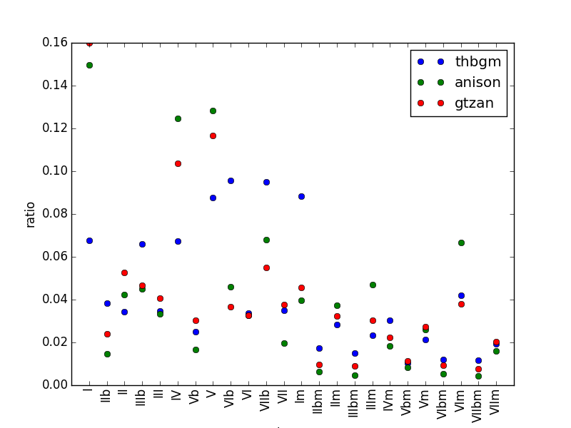

# コード進行
---

参考文献 [MPTrEE](http://ismir2012.ismir.net/event/papers/295_ISMIR_2012.pdf)

### コード進行

コード進行とは大雑把に言えば伴奏の和音の羅列のことで、曲の緊張と安定の流れといった雰囲気を強く決めています。コード進行を特徴として扱うにはコード進行を判定して調や頻度の調整をするので少し複雑です。

### コード進行の抽出

今回はHarmTraceで実装されているModel Propelled TRanscription of Euphonic Entities(MPTrEE)という手法でコード進行を抽出しました。詳しくは参考文献の論文を読んでください。
HarmTraceはHaskellで書かれており配布用のメンテナンスがされていないので、インストールは死ぬほど大変です。（HarmTraceのインストールの作業でそのほか全部を合わせたのと同じぐらい時間がかかっています。）詳しくは環境構築のharmtraceの導入方法を参照してください。以下はインストールが終わった後の話です。Essentiaというツールでもコード進行の判定ができるので、インストールが面倒であればこっちでも大丈夫だと思います。

HarmTraceをインストールして
```sh
harmtrace recognise -g pop -m mptree -i ./hoge.wav -o ./output/ -v ./vamp/ -f ./feature/ -w ./log/
```
とすると、./hoge.wavから読み込んだコード進行を./output/に出力します。./vamp/や./feature/は依存ソフトの設定ファイルや中間ファイルの保存フォルダなので、環境構築の方を参照してください。"-g pop"を"-g jazz"とジャズのモデルでコード進行を認識することもできますが、一般的なゲームとかポップスの場合はpopの方が認識率は高いです。

また、harmtraceは（私の環境では）.wav以外の入力を受け付けないので、mp3などは事前にwavに変換する必要があります。ffmpegをインストールしてこれをpythonから直接叩くか、pydubを入れて一時フォルダで変換を行います。

出力されるコードのフォーマットは\[beat\];\[chord\];\[startTime\];\[endTime\]です。
例えば、
```
1;A:min:8.96;1.97;2.21
```
という出力があれば、「この拍は一拍目で、この拍は楽曲の1.97秒から2.21秒の区間で、なっているコードはAmで、Amが鳴っている時間は8.96秒という意味になります。ちなみにpopで判定するとコードはC-BとCm-Bmの24種類です。C～Bを0～11、Cm～Bmに12-23とIDを振りことで、コード進行に対応した数列ができます。

### コード進行の変換

コード進行のコードネームは調に依存してシフトしますが、コードの役割を考えるうえで調の違いは本質的ではありません。よって、調を判定してディグリーネームに直してから判定を行います。

キーの判定はvamp pluginというライブラリ群のqm-vamppluginsのkeydetectorを利用します。keydetectorを用いるとある時刻での調がわかるので、最も近い拍のタイミングに転調のタイミングを合わせ、すべてのコードをディグリーネームに直します。keyについてはC～Bに0～11の数字を割り当てて、先ほどのIDから、(ID-key mod 12 + 12*(ID//12))を計算すればよいです。これで、C-BおよびCm-BmをI-VIIとIm-VIImと置き換えればおしまいです。

コード単発の頻度を見てみると、こんな感じです。



### N-gramの作成

変換したコードから、N続きのペアを作成します。N-gramでは24^N種類の単語が現れるので、100次元程度使うことを考えてN=1,2,3,4でやりました。[0,0,5,5,7,0]という配列から連続した同じコードを排除して[0,5,7,0]として、Nの数に応じて例えばN=2なら[[0,5],[5,7],[7,0]]とします。


### TFIDFベクトル化

全体の単語の種類は指数関数的に増えていくので、特徴ベクトルにする際にTFIDF値を基準に特徴量を削減します。TFIDF値は一般的すぎずマイナー過ぎないみたいな奴を評価する指標です。

TFIDFベクトル化はscikit-learnのTfidfVectorizerを用いることで簡単に行うことができます。注意点としてはTfidfVectorizerはもともと文章の解析用なので、単なる数字や一文字のアルファベットは自動的に排除してしまいます。なので、入力の際は適切に文字列やIDをマップしてIやVなどが削除されないようにしましょう。

このあたりの変換後の処理は[ここ](https://github.com/kodack64/toho_mir_ml/blob/master/convert/mir_make_degree.py)とか[ここ](https://github.com/kodack64/toho_mir_ml/blob/master/convert/mir_make_wordvector.py)です。
