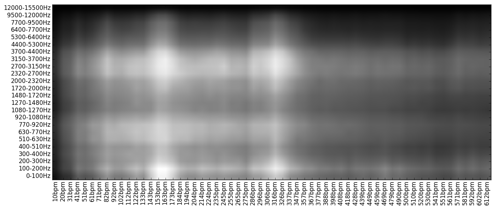

# リズム

---

参考文献 [Rhythm Pattern](http://ifs.tuwien.ac.at/mir/audiofeatureextraction.html)


#### 概要

リズムの特徴を抽出します。具体的には、楽器の帯域ごとに、スペクトラムの時間方向にパワースペクトラムをとったものを使用します。スペクトラムを時間方向にフーリエ変換すると「周波数-周波数-パワー」のグラフになりますが、X軸の周波数が100Hz以下の可聴域未満になるように、Y軸の周波数が200Hz程度の可聴域以上になるように調整します。こうすることで、3kHz帯の楽器のtempo140のパワーといった特徴が抜き出せます。これはRhythm Patternという名前がついているらしいです。

Rhythm Patternはrp_extractというpythonのライブラリでバッチ処理できます。[ここ](https://github.com/tuwien-musicir/rp_extract)で配布されていますがrp_extractはpython2で書いてあるので、python3を使っている場合は仮想環境を作るか2to3するかしましょう。

Y軸の可聴域側はバーク尺度は24次元になっており、X軸のリズム側は6秒間おきの離散信号をフーリエ変換した1.7Hzの分解能を持た60個のベクトルになっているため、データとしては6秒おきに24*60=1440要素の行列が得られます。これだと次元が大きすぎるので、実際に出力される値は、6秒おきに得られるデータを平均したものです。

#### 具体的な抽出

rp_extractは
```sh
python rp_extract [input file] [output name]
```
で実行できます。出力の形式は少し特殊で、[output name]に"./output/hoge"と書くと、["./output/hoge.rp","./output/hoge.rh","./output/hoge.ssd"]の三つが作成されます。
rpがFluctuation pattern(Rhythm pattern)で、rhはRhythm HistogramでRhythm Patternの音色の周波数軸方向にヒストグラムを取ったもの、SSDはStatistical Spectrum Descriptorです。

Rhythm Histogramはリズム方向60次元のベクトルですが、SSDとRPは本来は行列でこれをベクトルにnp.flattenしています。
このとき、ベクトルは[バーク尺度の24バンドの値(=音色方向の周波数)]が60回出てくる形になっています。例えば、SSD[0:24]は24個のバーク尺度におけるmeanになっています。バーク尺度の境界となる周波数はwikipediaに書いてあります。このあたりの話はソースコードを読まないと書いてないので、学習結果での重要度から元の特徴を類推する場合にどこかにメモっとかないと混乱します。

出力の行列を成形してプロットすると




こんな感じです。この図の白い部分に相当するbpm-freqの成分が強いとか弱いとか議論できるようになります。
