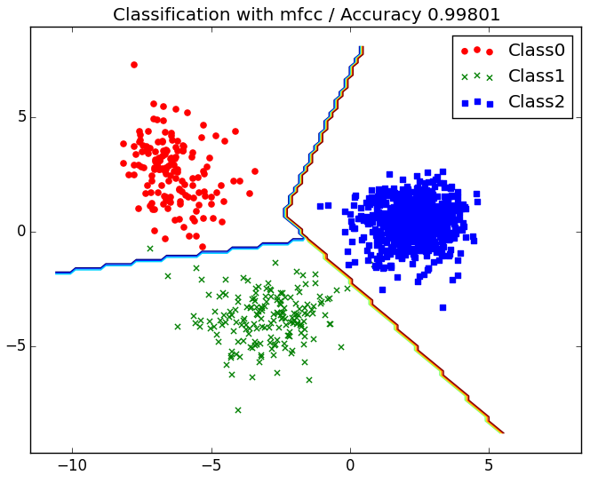
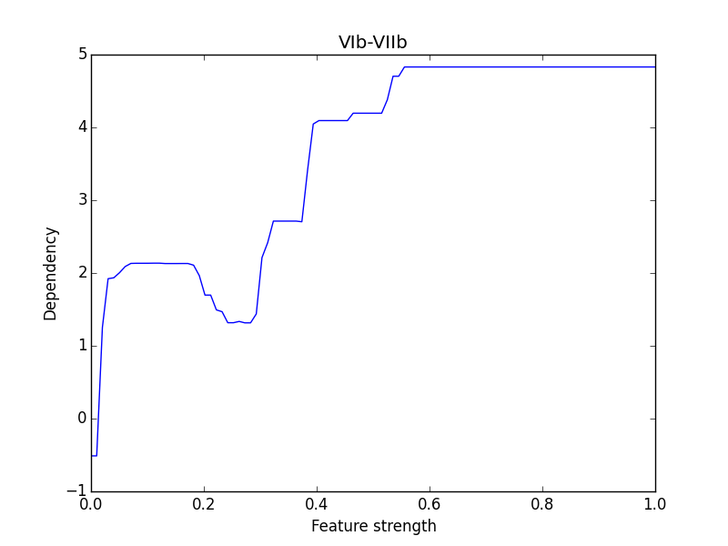

# 特徴選択と分析

---

この章では、
- 教師あり特徴選択/次元削減 (supervised feature selection / dimentionality reduction)
- データ可視化 (visualization)
- 特徴重要度と依存関係 (feature importance / dependency)

周辺でやったことを超ざっくりと書きます。日本語訳は適当なのであってるかはわかりません。この辺りはやってることはscikit-learnやstackoverflowの記事を読んで書いてるだけで、あと多分どれも一般的な話っぽいので、詳細はググってください。

#### 特徴選択

特徴の数が人間が分析するには多すぎなので、教師ありデータセットに対し、分類の上で重要そうな特徴を10個ぐらいとって行きます。Feature selectionの基本的な手法については[ここ](http://scikit-learn.org/stable/modules/feature_selection.html)が非常に参考になりました。手元ではLinearSVMとRandom Forestを用いたRecursive feature eliminationを試しました。やったことはscikit-learnのRFEのサンプル殆どそのまんまです。記事に乗っているのはLinearSVMを使って特徴選択したデータです。

#### 次元削減

教師なしで非常に大きな特徴ベクトルを情報量が減らないよううまい具合に削り、過学習を緩和します（多分）。特異値分解が代表的なんだと思いますが、t-Distributed Stochastic Neighbor Embedding(t-SNE)という方法も流行りのように見えます（多分）。動かしてはみましたが、教師ありデータでかつ特徴量の次元が少ないからか恩恵がよくわかりませんでした。あと、PCAは特徴ベクトルの基底を変えてしまうぽいので、もともとの基底に何らかの評論すべき文脈がある場合にはあまり向かないなという気もします。

#### データ可視化

データを分類したら、分類結果をconfusion matrixではなく、散布図みたいなやつで書いて分布を可視化してみたくなります。可視化できるのは原則として３次元以下なので、何らかの方法で特徴量を３次元まで削る必要があります。特徴の基底を変えずに散布図を描画したいのなら特徴選択をすればいいですし、predict_probaを用いてプロットすれば、n-class分類はn-1次元散布図になります。分類の傾向をアピールするのであれば、後者の方が分類精度の具合が見れるので良いかと思います。記事では負例の楽曲からアニソンを分離し、3-class分類をしました。

あと、散布図を書くと、SVMとかの分類機の分類の線を引きたくなります。分類の線の名前はdecision boundaryらしいので、descision boundary matplotlibみたいなので検索すれば境界付きのグラフの書き方が出てきます。基本的なやりかたはmeshgridを作ってcountourを引きます。

すると、こんな感じのが書けます。

精度がむっちゃいいのはこれがtrainingの結果だからです。

#### 特徴重要度と依存関係

仮に特徴選択をして特徴量を10個程度にしても、それぞれの特徴が正例、負例の判断とどういった相関を持っているかは不明です。RFEで特徴選択に使えるモデルは、特徴量の重要さを_coefから取り出すことができます。この値の絶対値の大きさが特徴の重要さです。

特に、LinearSVMのような線形な識別の場合は_coefの符号が境界の線を引く計数になっているので、単純に_coefの符号を見ることで正例にみられる特徴なのか、逆なのか、判断に使えないのかが分かります。

一方、Random Forestのような弱学習機を組み合わせたものでは、部分依存グラフを利用してより複雑な依存関係を調べることができます。部分依存グラフは、依存関係を知りたい特徴量について全てのサンプルに特定の共通の値を代入し、その値を最小値から最大値までスイープすることで、predict_probaの値がどう変化していくのかを調べたグラフです。はじめてのパターン認識のRandomForestの章に数式が書いてあったのでそれをそのまま使いました。

こちらはLinearSVMの場合に比べ、「極端に多いor小さい」などといった線形に分離できないけど重要な特徴を可視化できるものの、特徴量が多いと精度が良い学習ができていても実行のたびにfeature importanceが変わってしまい結果があまり安定しません。この場合は特徴選択をしておくと結果が安定するようになります。下のはXGBoostを使ったコード進行に対する部分依存グラフの例です。

