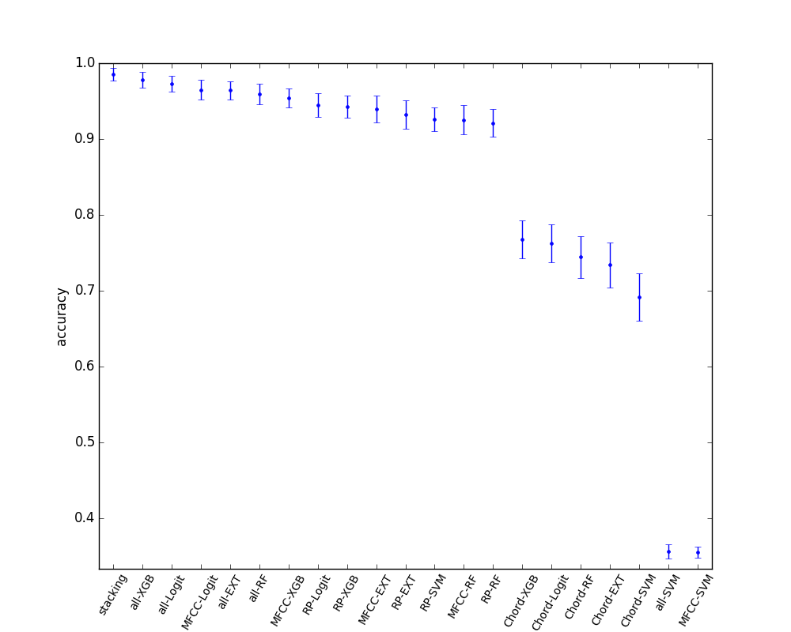

# 複数種の特徴量を用いた分類

---

参考 [puyokwさまブログ](http://puyokw.hatenablog.com/entry/2015/12/12/090000)

この章では、複数の異なる種類のモデルや特徴量を分析して、その全体を用いて一つの良い推定をすることを目指します。手法自体はアンサンブル学習の一種になるのだと思いますが、特にこういうアプローチをstacked generalization、あるいはstackingというらしいです。

今回の技術的なテーマとしては、これをやってみたかったというのが大きいです。人間は音楽の文脈をいくつかの情報に分解し、総合的に判断します。特徴を纏めて機械学習で総合的に判断する方法の一つは特徴ベクトルを単純につなげる方法ですが、そうするとベクトルが長くなって過学習しやすくなっちゃいそうだし、MFCCとコード進行は独立した特徴であるという点を捨てているので、無意味な分類を助長してしまいそうです。

今回は音楽というrawデータから、MFCC,コード進行の頻度、リズムパターンという三種類の特徴量を取り出しているので、この特徴量の学習結果をさらにアンサンブルしてよりよい判定ができるようになることを期待しました。こうすると、音域、コード進行、リズム感の三つを総合してアーティストを判断していることになり、それっぽいなと思いました。

今回のstackingは三つのレイヤーに分けています。

- MFCC,コード進行のTFIDFベクトル、リズムパターンを抽出
- それぞれにRandomForest,XGBoost,SVC,ExtraTreeClassifier,Logitを適用して5-foldで全データのpredict_probaを計算
- 上記のpredict_probaを特徴量として、さらにXGBoostで分類を行う。

詳細は図と出力を見て理解してください。

[このあたりやってるソースコード](https://github.com/kodack64/toho_mir_ml/blob/master/learn/ml_stacking.py)




```sh
E:\VMShare>python ml_execute.py -stacking
*** data load ***
['mfcc', 'tfidf_3gram', 'ssd'] ['thbgm', 'gtzan', 'anison']
train,test = 161,70
featureCount boundary = [0, 280, 480, 648]
models = [RandomForestClassifier(bootstrap=True, class_weight=None, criterion='gini',
            max_depth=None, max_features='auto', max_leaf_nodes=None,
            min_samples_leaf=1, min_samples_split=2,
            min_weight_fraction_leaf=0.0, n_estimators=10, n_jobs=1,
            oob_score=False, random_state=None, verbose=0,
            warm_start=False), XGBClassifier(base_score=0.5, colsample_bylevel=1, colsample_bytree=1,
       gamma=0, learning_rate=0.1, max_delta_step=0, max_depth=3,
       min_child_weight=1, missing=None, n_estimators=100, nthread=-1,
       objective='binary:logistic', reg_alpha=0, reg_lambda=1,
       scale_pos_weight=1, seed=0, silent=True, subsample=1), SVC(C=1, cache_size=200, class_weight=None, coef0=0.0, degree=3, gamma=0.0,
  kernel='rbf', max_iter=-1, probability=True, random_state=None,
  shrinking=True, tol=0.001, verbose=False), ExtraTreesClassifier(bootstrap=False, class_weight=None, criterion='gini',
           max_depth=None, max_features='auto', max_leaf_nodes=None,
           min_samples_leaf=1, min_samples_split=2,
           min_weight_fraction_leaf=0.0, n_estimators=10, n_jobs=1,
           oob_score=False, random_state=None, verbose=0, warm_start=False), LogisticRegression(C=1.0, class_weight=None, dual=False, fit_intercept=True,
          intercept_scaling=1, max_iter=100, multi_class='ovr',
          penalty='l2', random_state=None, solver='liblinear', tol=0.0001,
          verbose=0)]

*** 1st layer ***
first layer from thbgm-mfcc : (231, 280)
first layer from thbgm-tfidf_3gram : (231, 200)
first layer from thbgm-ssd : (231, 168)
first layer from gtzan-mfcc : (1000, 280)
first layer from gtzan-tfidf_3gram : (1000, 200)
first layer from gtzan-ssd : (1000, 168)
first layer from anison-mfcc : (269, 280)
first layer from anison-tfidf_3gram : (269, 200)
first layer from anison-ssd : (269, 168)
train vector : (483, 648) label (483,)
test vector : (210, 648) label (210,)

*** 2nd layer ***
3-class * 5-models * 3-features -> length = 45
5-fold * 5-models * 3-features -> #train = 75
0th fold : 0th feature : 0th model : validation acc = 0.9191919191919192
0th fold : 0th feature : 1th model : validation acc = 0.9595959595959596
0th fold : 0th feature : 2th model : validation acc = 0.35353535353535354
0th fold : 0th feature : 3th model : validation acc = 0.9494949494949495
0th fold : 0th feature : 4th model : validation acc = 0.9393939393939394
0th fold : 1th feature : 0th model : validation acc = 0.7777777777777778
0th fold : 1th feature : 1th model : validation acc = 0.7575757575757576
0th fold : 1th feature : 2th model : validation acc = 0.6767676767676768
0th fold : 1th feature : 3th model : validation acc = 0.7474747474747475
0th fold : 1th feature : 4th model : validation acc = 0.7474747474747475
0th fold : 2th feature : 0th model : validation acc = 0.9292929292929293
0th fold : 2th feature : 1th model : validation acc = 0.9494949494949495
0th fold : 2th feature : 2th model : validation acc = 0.898989898989899
0th fold : 2th feature : 3th model : validation acc = 0.9191919191919192
0th fold : 2th feature : 4th model : validation acc = 0.9393939393939394
1th fold : 0th feature : 0th model : validation acc = 0.8854166666666666
1th fold : 0th feature : 1th model : validation acc = 0.9583333333333334
1th fold : 0th feature : 2th model : validation acc = 0.3541666666666667
1th fold : 0th feature : 3th model : validation acc = 0.90625
1th fold : 0th feature : 4th model : validation acc = 0.9270833333333334
1th fold : 1th feature : 0th model : validation acc = 0.6770833333333334
1th fold : 1th feature : 1th model : validation acc = 0.7604166666666666
1th fold : 1th feature : 2th model : validation acc = 0.7083333333333334
1th fold : 1th feature : 3th model : validation acc = 0.71875
1th fold : 1th feature : 4th model : validation acc = 0.71875
1th fold : 2th feature : 0th model : validation acc = 0.96875
1th fold : 2th feature : 1th model : validation acc = 0.96875
1th fold : 2th feature : 2th model : validation acc = 0.96875
1th fold : 2th feature : 3th model : validation acc = 0.9166666666666666
1th fold : 2th feature : 4th model : validation acc = 0.9375
2th fold : 0th feature : 0th model : validation acc = 0.90625
2th fold : 0th feature : 1th model : validation acc = 0.9583333333333334
2th fold : 0th feature : 2th model : validation acc = 0.375
2th fold : 0th feature : 3th model : validation acc = 0.9270833333333334
2th fold : 0th feature : 4th model : validation acc = 0.9583333333333334
2th fold : 1th feature : 0th model : validation acc = 0.6979166666666666
2th fold : 1th feature : 1th model : validation acc = 0.75
2th fold : 1th feature : 2th model : validation acc = 0.7708333333333334
2th fold : 1th feature : 3th model : validation acc = 0.7291666666666666
2th fold : 1th feature : 4th model : validation acc = 0.7604166666666666
2th fold : 2th feature : 0th model : validation acc = 0.9375
2th fold : 2th feature : 1th model : validation acc = 0.9166666666666666
2th fold : 2th feature : 2th model : validation acc = 0.9166666666666666
2th fold : 2th feature : 3th model : validation acc = 0.9375
2th fold : 2th feature : 4th model : validation acc = 0.9479166666666666
3th fold : 0th feature : 0th model : validation acc = 0.875
3th fold : 0th feature : 1th model : validation acc = 0.9479166666666666
3th fold : 0th feature : 2th model : validation acc = 0.375
3th fold : 0th feature : 3th model : validation acc = 0.9166666666666666
3th fold : 0th feature : 4th model : validation acc = 0.9270833333333334
3th fold : 1th feature : 0th model : validation acc = 0.7708333333333334
3th fold : 1th feature : 1th model : validation acc = 0.78125
3th fold : 1th feature : 2th model : validation acc = 0.7708333333333334
3th fold : 1th feature : 3th model : validation acc = 0.7708333333333334
3th fold : 1th feature : 4th model : validation acc = 0.7916666666666666
3th fold : 2th feature : 0th model : validation acc = 0.9583333333333334
3th fold : 2th feature : 1th model : validation acc = 0.9895833333333334
3th fold : 2th feature : 2th model : validation acc = 0.9166666666666666
3th fold : 2th feature : 3th model : validation acc = 0.9583333333333334
3th fold : 2th feature : 4th model : validation acc = 0.9583333333333334
4th fold : 0th feature : 0th model : validation acc = 0.8854166666666666
4th fold : 0th feature : 1th model : validation acc = 0.9479166666666666
4th fold : 0th feature : 2th model : validation acc = 0.375
4th fold : 0th feature : 3th model : validation acc = 0.9375
4th fold : 0th feature : 4th model : validation acc = 0.9895833333333334
4th fold : 1th feature : 0th model : validation acc = 0.8229166666666666
4th fold : 1th feature : 1th model : validation acc = 0.8229166666666666
4th fold : 1th feature : 2th model : validation acc = 0.7291666666666666
4th fold : 1th feature : 3th model : validation acc = 0.8020833333333334
4th fold : 1th feature : 4th model : validation acc = 0.8229166666666666
4th fold : 2th feature : 0th model : validation acc = 0.875
4th fold : 2th feature : 1th model : validation acc = 0.8854166666666666
4th fold : 2th feature : 2th model : validation acc = 0.9375
4th fold : 2th feature : 3th model : validation acc = 0.8958333333333334
4th fold : 2th feature : 4th model : validation acc = 0.9583333333333334
0 th feature mfcc : ave acc = 0.8181818181818183
1 th feature tfidf_3gram : ave acc = 0.7553661616161617
2 th feature ssd : ave acc = 0.9354545454545453
0th feature : 0th model : test acc = 0.9285714285714286
0th feature : 1th model : test acc = 0.9809523809523809
0th feature : 2th model : test acc = 0.3523809523809524
0th feature : 3th model : test acc = 0.919047619047619
0th feature : 4th model : test acc = 0.9761904761904762
1th feature : 0th model : test acc = 0.7428571428571429
1th feature : 1th model : test acc = 0.7142857142857143
1th feature : 2th model : test acc = 0.6761904761904762
1th feature : 3th model : test acc = 0.7285714285714285
1th feature : 4th model : test acc = 0.7571428571428571
2th feature : 0th model : test acc = 0.8857142857142857
2th feature : 1th model : test acc = 0.9238095238095239
2th feature : 2th model : test acc = 0.8809523809523809
2th feature : 3th model : test acc = 0.9095238095238095
2th feature : 4th model : test acc = 0.9333333333333333
all feature : 0th model : test acc = 0.9238095238095239
all feature : 1th model : test acc = 0.9809523809523809
all feature : 2th model : test acc = 0.3523809523809524
all feature : 3th model : test acc = 0.9571428571428572
all feature : 4th model : test acc = 0.9857142857142858
train vector (483, 45)
test vector (210, 45)

*** 3rd layer ***
final acc (train,test) = 1.0,0.9904761904761905
```

まぁぶっちゃけ差がそれほど大きいわけでない上にサンプル数が小さいため実行するたびに結果が結構変わってしまいはするのですが、テストデータの切り方をランダムに変えまくって結果の統計を取りました。（データが小さいので便宜的にこうしていますが、多分このやり方は好ましくないのかなと思います。）

どれかのみの特徴量だけを使う場合に比べてstackingした結果は1.7(9)%だけ精度が改善します。よって、どれかだけの特徴を見るより、総合的に判断すると良い精度が出ることが分かります。

一方で、すべての特徴ベクトルを単純に結合した場合に比べると、0.4(9)%と改善はしているけどTestセットの取り方によっては常に良いわけではないという感じです。データセットがもう少し大きくできれば有意差が示せそうではありますが、正例が増やせないのとそもそもほぼ100%なので難しそうです。

単純に特徴量を結合するとおよそ500個のサンプルに650個のベクトルがついていることになるので、過学習しまくってしまうことを期待していたのですが、データに相関があるからかあんまそういうことはありませんでした。
